### Usage Example

We will now look at a practical example of using the infrastructure built with two nodes and two users.
All the steps taken will be listed point by point.

#### Starting Both Nodes

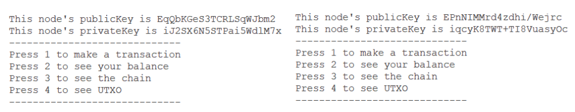

markdown
Copia codice
Each node, upon starting, displays its own key pair on the screen, followed by a menu that allows various operations. In
this example, the nodes have IP addresses `192.168.1.1` and `192.168.1.2`, respectively.

#### Connection of the First User to the First Node

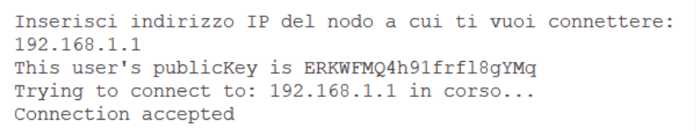

The first user who connects to the network receives the genesis transaction, which has a value of 100. This will be the
only transaction in the first block of the blockchain, called the genesis block. This block must be validated as soon as
the genesis transaction is added, allowing the transaction's value to be spent by its recipient.

#### Mining Process of the Genesis Block

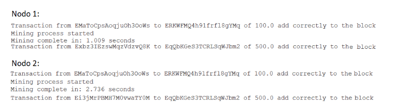

After the first user connects, both nodes perform the proof of work for the genesis block. As shown in the screenshots
provided, the first node takes 1.009 seconds to find the correct nonce, while the second node takes 2.736 seconds.  
Each node continues its proof of work on its own block until it receives a valid blockchain longer than the one it
currently has.  
When this occurs, the node replaces its blockchain with the received one.

If, as in this case, two nodes complete the proof of work in very close timeframes without having received a valid
chain, they add their validated block to their own blockchain. They will then proceed to forward their blockchain to all
other nodes.  
Afterward, each node adds a Coinbase transaction to the next block with a fixed value of 500.

#### Now the User Requests Their Balance

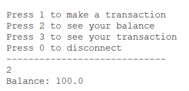

#### Connessione del secondo utente al secondo nodo

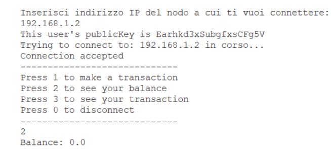

The genesis transaction has already been completed, so this new user's wallet has an initial balance of 0.

The first user, who has a balance of 100, makes a transaction of 10 to the second user's address.

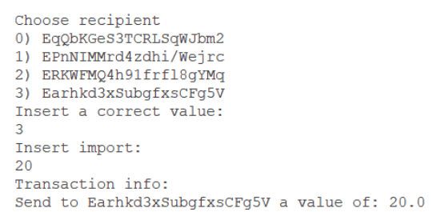

After receiving and validating the latest transaction, the nodes will close the current block once they reach the
established limit of 3 transactions.  
As shown in the screenshot below, the first node takes 1.38 seconds to complete the proof of work. The second node,
however, has not yet finished its proof of work when it receives the full chain from the first node with the newly added
block. In this case, after verifying its validity, the second node replaces its blockchain with the one received.

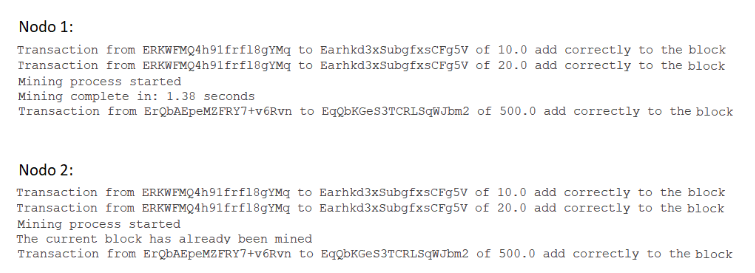

The second block has been added to the blockchain. The outputs within it are now visible and spendable by their
respective owners.  
Let's now take a look at the updated balances of the users and the nodes:

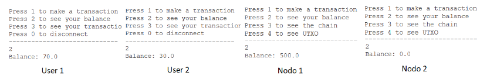

User 2 makes a transaction of 25 to the node it is connected to, which is Node 2.

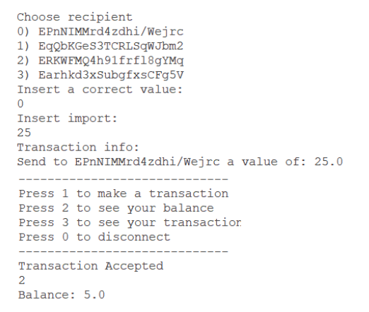

The users can now view their transaction history.

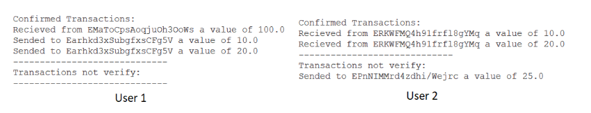

Le transazioni non verificate corrispondono a quelle presenti in un blocco non ancora validato.
Il vettore UTXO dei nodi ha il seguente aspetto:

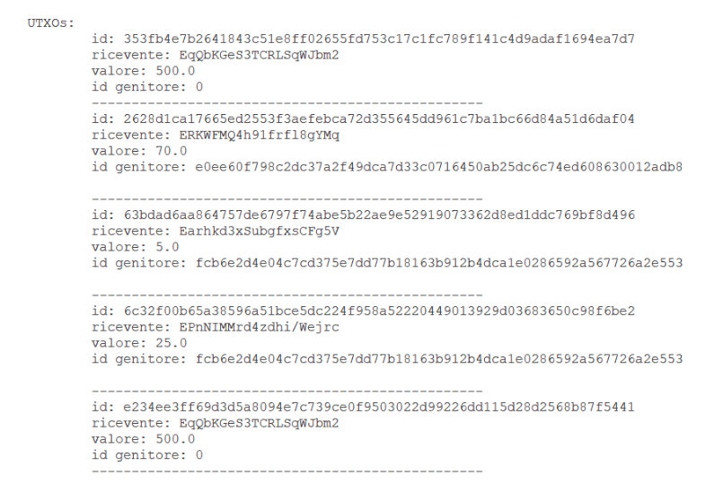

Briefly analyzing:

- The first transaction is the reward received by the first node for mining the genesis block.
- The second transaction concerns User 1, who received 100 from the genesis transaction and then gave 30 to the other
  user. Therefore, User 1 has 70 spendable.
- The third transaction belongs to User 2, who received 30 but then sent 25 to the node it was connected to.
- The fourth transaction is the one from Node 2, as previously mentioned.
- The last transaction is the Coinbase transaction from the block following the genesis block.

In conclusion, a printout of the entire blockchain is made, including the current block:

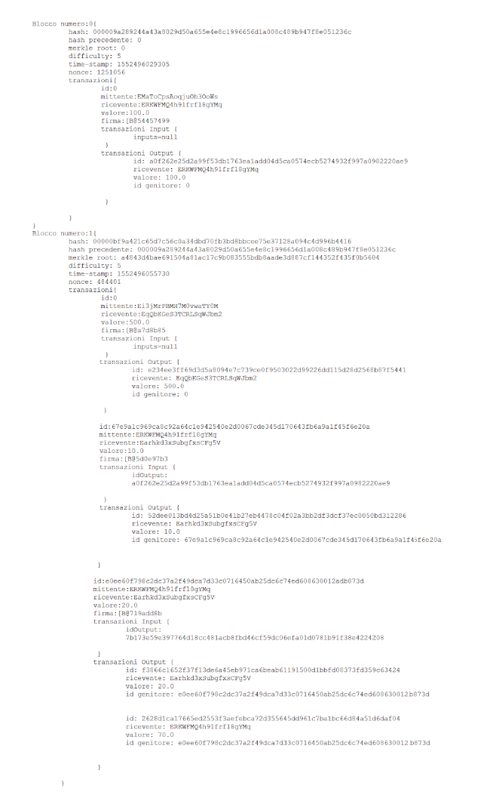
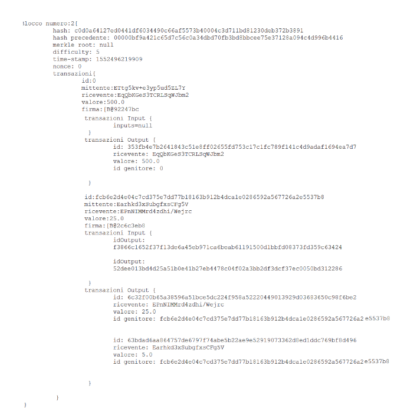

### Design Choices

The Bitcoin protocol forms the foundation of this implementation, yet there are several key differences:

- **Object Fields**: The attributes of each structure, such as a transaction or a block, have been chosen to simplify
  the readability of the code and the understanding of the algorithms used.

- **Block Size**: Unlike Bitcoin, where blocks have a fixed byte size limit, the block here has no byte size limit but
  instead has a maximum number of transactions it can contain. For simplicity of verification, this limit is set to 3.

- **Absence of Scripts**: To use an output as an input for a new transaction, one must prove ownership of the private
  key corresponding to the public key specified as the recipient of the output. This process is done without using the
  scripts typically used in Bitcoin.

- **Mining Times**: To allow for quick verification of the network’s functionality and given the
  educational-experimental nature of the project, the mining time is kept relatively short. This time is kept almost
  constant by appropriately adjusting the difficulty of the blocks.

- **Forks**: Each node can only have one blockchain in memory, meaning secondary chain blocks are not stored. As entire
  chains are exchanged rather than individual blocks, once the proof of work is completed, all blockchain copies are
  updated so that, with every new block, all nodes have the same blockchain.

- **Transaction Fees**: Transaction fees are not implemented in this project. Therefore, the reward for nodes is solely
  the Coinbase transaction, and any excess inputs in a transaction are returned to the sender.
